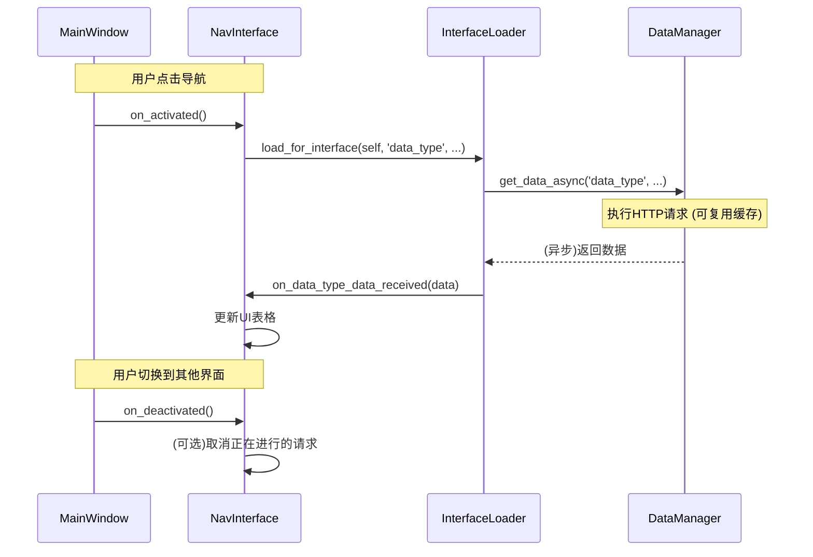

# 项目架构与数据加载逻辑指南

本文档旨在阐明 `pyQTClient` 的整体架构、UI导航模式以及核心的数据加载流程，以便于新成员快速理解项目并进行后续开发。

## 1. 整体架构

项目采用经典的前后端分离架构：

- **后端 (`DjangoService`)**: 基于 `Django` 和 `Django Rest Framework` 构建的RESTful API服务。它负责所有的业务逻辑、数据库交互和数据提供。
- **前端 (`pyQTClient`)**: 一个使用 `PyQt5` 和 `qfluentwidgets` 库构建的桌面客户端。它作为用户交互的入口，负责展示数据和向后端发送请求。

两者通过HTTP协议进行通信，实现了业务逻辑与用户界面的完全解耦。

```mermaid
graph TD;
    subgraph pyQTClient (桌面客户端)
        direction LR
        A[UI界面 (Views)] --> B{数据管理器 (DataManager)};
        B --> C[API客户端 (API Client)];
    end

    subgraph DjangoService (后端服务)
        direction LR
        D[Django REST API];
    end

    C -- HTTP请求 --> D;
    D -- JSON响应 --> C;

    style pyQTClient fill:#cde4ff,stroke:#8a9fbe,stroke-width:2px
    style DjangoService fill:#d5e8d4,stroke:#82b366,stroke-width:2px
```

## 2. PyQt客户端 (`pyQTClient`) 架构

客户端内部遵循分层设计，主要目录结构如下：

- **`app/view/`**: **视图层**。包含所有的UI界面（窗口、对话框、页面等）。
  - `login_window.py`: 应用启动时的登录窗口。
  - `main_window.py`: 应用主窗口，作为所有子界面的容器，并负责导航。
  - `nav_interface.py`: 定义了可导航界面基类 `NavInterface`，包含 `on_activated`/`on_deactivated` 钩子函数，是所有主功能页面的推荐基类。
  - `*_interface.py`: 构成应用核心功能的各个页面，例如`DashboardInterface` (系统概览), `ToolInterface` (刀具管理) 等。
  - `file_transfer_manager.py`: 位于主窗口标题栏的文件传输状态管理器。
  - `download_interface.py`: 文件下载管理的独立界面。
  - `task_detail_interface.py`: 用于显示单个任务详细信息的界面。

- **`app/api/`**: **数据与通信层**。负责与后端API的所有交互。
  - `api_client.py`: 一个封装了`requests`的底层API客户端，提供对每个API端点的直接调用方法（如 `get_tools`, `add_tool`等），并管理用户认证状态。
  - `async_api.py`: 提供了对 `api_client` 中部分方法的异步封装，主要用于非UI线程的批量或后台操作。
  - `data_manager.py`: **核心数据管理器**。它是所有UI界面获取后端数据的首选入口。它在`api_client`之上提供了更高级的功能：
    - **异步处理**: 使用`QThread`将网络请求放在后台执行，避免UI冻结。
    - **请求缓存**: 在短时间内缓存API请求结果，避免对相同数据的重复请求。
    - **请求合并**: 当多个界面同时请求同一数据时，只发出一个实际的网络请求，并将结果分发给所有请求方。
    - `interface_loader`: 一个便捷的加载器，进一步简化了界面加载数据的代码。

- **`app/common/`**: **通用工具层**。存放项目范围内的通用模块。
  - `config.py`: 配置文件读写模块。
  - `signal_bus.py`: 全局信号总线，用于跨模块的事件通知。
  - `icon.py`: `FluentIcon` 的枚举和辅助函数。
  - `translator.py`: 国际化和翻译相关工具。
  - `trie.py`: 前缀树数据结构，可用于搜索建议等功能。


## 3. UI导航与数据加载逻辑

### 3.1. UI导航机制

- 应用的导航由 `main_window.py` 中的 `QStackedWidget` 管理。
- 左侧的导航栏 (`NavigationInterface`) 中的每个项目都与 `stackedWidget` 中的一个界面对应。
- 当用户点击导航项时，`main_window` 会切换 `stackedWidget` 到对应的界面，并触发该界面的 `on_activated()` 方法（如果该界面继承自 `NavInterface`）。
- 这个切换动作由 `stackedWidget` 的 `currentChanged` 信号驱动，该信号连接到 `main_window.py` 的 `on_interface_changed` 方法，方法内部会调用标准激活流程。

### 3.2. 数据加载流程：`NavInterface` 激活模式

项目所有核心功能界面均采用统一的、基于 `NavInterface` 的按需加载模式。

- **适用界面**: 所有在主窗口导航栏中可切换的界面，如 `DashboardInterface`, `ToolInterface`, `UserInterface` 等。
- **核心思想**: 每个界面自我管理其数据加载和清理的生命周期，与主窗口完全解耦。
- **流程**:
  1.  当`main_window`通过导航切换到目标界面时，会自动调用该界面的 `on_activated()` 方法。
  2.  界面的 `on_activated()` 方法内部调用 `interface_loader.load_for_interface()` 来发起一个异步数据请求。
  3.  `interface_loader` 委托 `data_manager` 执行实际的HTTP请求，并处理缓存与请求合并逻辑。
  4.  请求完成后，`interface_loader` 会自动调用界面上预定义的标准回调方法（例如 `on_tools_data_received(data)` 或 `on_tools_data_error(error)`)。
  5.  界面在自己的回调方法中，将获取到的数据填充到UI控件（如表格）中。
  6.  当界面被切换离开时，`main_window` 会调用其 `on_deactivated()` 方法，界面可在此方法内执行取消请求等清理工作。

- **优点**:
  - **高内聚，低耦合**: 界面自我管理，无需主窗口干预。
  - **按需加载**: 只在界面被激活时才加载数据，节省资源。
  - **生命周期清晰**: `on_activated` 和 `on_deactivated` 提供了清晰的入口和出口。
  - **代码一致**: 所有界面遵循统一的接口和回调命名，易于理解和维护。



## 4. 历史架构回顾

项目初期曾存在一种"主窗口驱动模式"（模式二），即由 `main_window.py` 的 `on_interface_changed` 方法通过 `if/elif` 判断当前界面，并为其主动调用数据加载方法。该模式存在**重复加载**和**高耦合**等问题，现已完全被 `NavInterface` 激活模式取代。

目前 `main_window.py` 中的 `on_interface_changed` 方法已被大大简化，仅负责调用所有 `NavInterface` 子类的 `on_activated` / `on_deactivated` 方法和处理看板的定时器，不再包含任何针对特定界面的数据加载逻辑。

## 5. 架构状态总结

### 已完成的标准化界面
截至2024年7月28日，以下所有核心功能界面均已遵循 `NavInterface` 激活模式进行开发和重构：
- `DashboardInterface` ✅
- `ProcessingTaskInterface` ✅
- `TaskGroupInterface` ✅
- `ToolInterface` ✅
- `CompositeMaterialInterface` ✅
- `SensorDataInterface` ✅
- `UserInterface` ✅
- `SettingInterface` ✅

### 架构优势
- ✅ **重复加载问题已解决**：数据不再在初始化和界面切换时被加载两次。
- ✅ **代码耦合度已降低**：主窗口不再需要知道各界面的具体实现细节。
- ✅ **代码一致性已提升**：所有界面现在都遵循统一的数据加载模式。
- ✅ **生命周期管理完善**：所有界面都正确实现了激活和取消激活的生命周期管理。
- ✅ **资源清理机制健全**：界面切换时能够正确取消网络请求，避免内存泄漏。
- ✅ **文档与实现同步**：本文档已根据最新的代码状态进行了全面更新。

在进行代码重构或重要功能修改后，请继续保持相关文档的同步更新。

## 6. 架构状态与待办事项 (2025-06-29)

本章节旨在提供项目当前架构状态的快照，并明确列出需要优先解决的技术债和优化项。

### 6.1. 当前架构状态总结

- ✅ **核心模式统一**: 所有主导航界面均已遵循 `NavInterface` 激活模式，实现了按需加载和清晰的生命周期管理。
- ✅ **组件成功解耦**: **（已完成）** 核心UI组件（如对话框、自定义部件）已从主界面 (`*.interface.py`) 文件中完全分离，并迁移至独立的 `app/view/components/` 目录下，显著提升了代码的模块化和可维护性。
- ✅ **导入风格统一**: **（已完成）** 解决了模块间绝对路径和相对路径混用的问题，统一采用相对路径导入，提升了代码的一致性并规避了潜在的BUG。
- ✅ **任务分组加载优化**: **（已完成）** 通过新增后端API `task-groups/with_tasks/`，将原有的"先获取分组，再获取任务"的瀑布流加载方式优化为一次性获取完整数据结构，大幅简化了前端逻辑并提升了性能。
- ✅ **重复加载问题已解决**: 界面切换时的数据重复加载问题已不存在。
- ✅ **代码冗余度降低**: 基于表格的界面已移除手动的表格填充逻辑，统一由 `InterfaceLoader` 负责。
- ✅ **死代码已清理**: 已移除废弃的 `download_interface.py` 模块。

### 6.2. 现有问题与优化建议

尽管项目在标准化和组件化方面取得了显著进展，但仍存在以下亟待解决的结构性问题和不一致之处。建议按照优先级顺序进行处理。

---

#### 1. `DashboardInterface` 数据加载方式不一致 - <font color="red">**高优先级**</font>
- **问题描述**: `DashboardInterface` 直接调用底层的 `data_manager.get_data_async()` 来获取多项数据，而其他所有界面均通过更高层的 `interface_loader` 加载。
- **潜在影响**: 虽然功能正常，但这破坏了数据加载方式的统一性。未来对 `interface_loader` 的增强（如统一的加载动画）可能无法自动应用到看板界面。
- **优化建议**: 考虑为 `DashboardInterface` 创建一个自定义的加载函数并注册到 `data_manager` 中，然后通过 `interface_loader` 来调用，以保持入口的统一。
